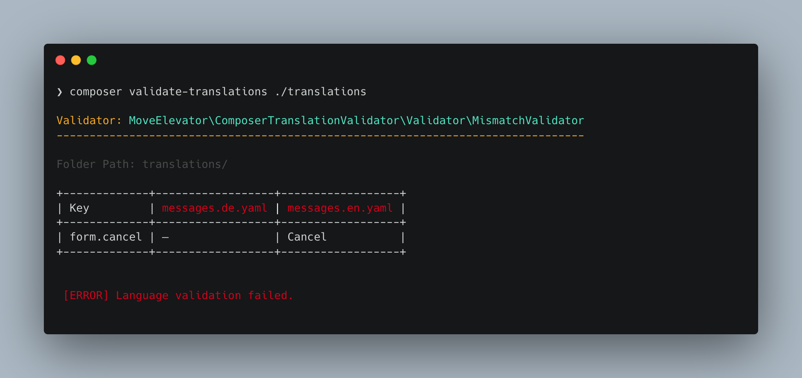

<div align="center">

# Composer Translation Validator

[](https://coveralls.io/github/move-elevator/composer-translation-validator)
[](https://github.com/move-elevator/composer-translation-validator/actions/workflows/cgl.yml)
[](https://github.com/move-elevator/composer-translation-validator/actions/workflows/tests.yml)
[](https://packagist.org/packages/move-elevator/composer-translation-validator)

</div>

A Composer plugin that validates translation files in your project.
Provides a command `validate-translations` to check for translations mismatches, duplicates and schema validation.

## ✨ Features

* Autodetect coherent language files
* Supports various translation formats
* Provides multiple validators

## 🔥 Installation

[](https://packagist.org/packages/move-elevator/composer-translation-validator)
[](https://packagist.org/packages/move-elevator/composer-translation-validator)


```bash
composer require --dev move-elevator/composer-translation-validator
```

## 📊 Usage

```bash
composer validate-translations [<path>]
```



The command `validate-translations` can be used to validate translation files in your project. It will automatically detect the translation files based on the supported formats and run the configured validators.

```bash
composer validate-translations [<path>] [-dr|--dry-run] [-f|--format cli|json] [-s|--skip VALIDATOR] [-o|--only VALIDATOR] [-v|--verbose]
```

| Argument / Option         | Shortcut   | Description                                                                                       |
|--------------------------|------------|---------------------------------------------------------------------------------------------------|
| `<path>`                 |            | (Optional) Path to the translation files or directories to validate (can be used multiple times). |
| `--dry-run`              | `-dr`      | Runs the validation in test mode without saving changes.                                          |
| `--format`               | `-f`       | Sets the output format (`cli`, `json`).                                                           |
| `--skip`                 | `-s`       | Skips specific validators (can be used multiple times).                                           |
| `--only`                 | `-o`       | Runs only the specified validators (can be used multiple times).                                  |
| `--strict`               |            | Enables strict mode, treating warnings as errors.                                                 |
| `--verbose`              | `-v`       | Shows additional output for detailed information.                                                 |
| `--config`               | `-c`       | Path to a configuration file (e.g. `translation-validator.yaml`).                                 |


## 📝 Documentation

### Supported Formats

The plugin supports the following translation file formats (and targets the following frameworks):

| Format                                       | Description                                                                                                  | Framework | Example files                          |
|----------------------------------------------|--------------------------------------------------------------------------------------------------------------|-----------|----------------------------------------|
| [XLIFF](https://en.wikipedia.org/wiki/XLIFF) | Supports source/target translations in xliff language files. | [TYPO3 CMS](https://typo3.org/)          | `locallang.xlf`, `de.locallang.xlf`    |
| [Yaml](https://en.wikipedia.org/wiki/YAML)   | Supports yaml language files.                     | [Symfony Framework](https://symfony.com/)          | `messages.en.yaml`, `messages.de.yaml` |

### Validators

The following validators are available:

| Validator                  | Function                                                                                                                                                                 | Supports    | Throws  |
|----------------------------|--------------------------------------------------------------------------------------------------------------------------------------------------------------------------|-------------|---------|
| `MismatchValidator`        | This validator checks for keys that are present in some files but not in others. It helps to identify mismatches in translation keys across different translation files. | XLIFF, Yaml | WARNING   |
| `DuplicateKeysValidator`   | This validator checks for duplicate keys in translation files.                                                                                                           | XLIFF       | ERROR   |
| `DuplicateValuesValidator` | This validator checks for duplicate values in translation files.                                                                                                         | XLIFF, Yaml     | WARNING |
| `SchemaValidator`          | Validates the XML schema of translation files against the XLIFF standard. See available [schemas](https://github.com/symfony/translation/tree/6.4/Resources/schemas).    | XLIFF       | ERROR   |


## 🧑‍💻 Contributing

Please have a look at [`CONTRIBUTING.md`](CONTRIBUTING.md).

## ⭐ License

This project is licensed under [GNU General Public License 3.0 (or later)](LICENSE).
