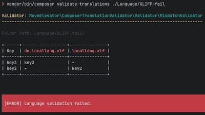

# Composer translation validator plugin

A Composer plugin that validates translation files in your project regarding mismatches between language files.

## Features

* Autodetect according to language files
* Detects missing translations
* Supports the following formats:
  * XLIFF - `*.xlf`, `*.xliff`
* Support the following validators:
  * [MismatchValidator](src/Validator/MismatchValidator.php)
  * [DuplicatesValidator](src/Validator/DuplicatesValidator.php)
  * [SchemaValidator](src/Validator/SchemaValidator.php)

## Installation

```bash
composer require --dev move-elevator/composer-translation-validator
```

## Usage

```bash
composer validate-translations ./Resources/Private/Language
```


See [ValidateTranslationCommand.php](src/Command/ValidateTranslationCommand.php) for further details.

## Testing

Run the following command to execute a test scenario:

```bash
test/Build/app/vendor/bin/composer translation:xliff:all:check

```

## License

This project is licensed under [GNU General Public License 3.0 (or later)](LICENSE.md).
