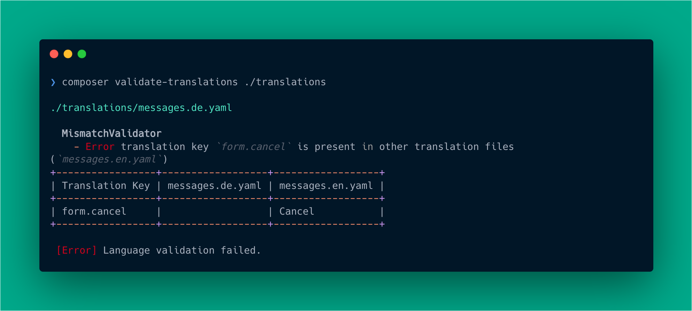

<div align="center">

# Composer Translation Validator

[](https://coveralls.io/github/move-elevator/composer-translation-validator)
[](https://github.com/move-elevator/composer-translation-validator/actions/workflows/cgl.yml)
[](https://github.com/move-elevator/composer-translation-validator/actions/workflows/tests.yml)
[](https://packagist.org/packages/move-elevator/composer-translation-validator)

</div>

A Composer plugin that validates translation files in your project.
Provides a command `validate-translations` to check for translations mismatches, duplicates, schema validation and more.
Supports XLIFF, YAML, JSON and PHP translation files.

**[View Documentation](https://move-elevator.github.io/composer-translation-validator/)**

## ✨ Features

* Autodetect coherent language files
* Supports various [translation file formats](https://move-elevator.github.io/composer-translation-validator/reference/file-formats)
* Provides multiple [validators](https://move-elevator.github.io/composer-translation-validator/reference/validators)
* Configurable via separate [configuration files](https://move-elevator.github.io/composer-translation-validator/configuration/)

## 🔥 Installation

[](https://packagist.org/packages/move-elevator/composer-translation-validator)
[](https://packagist.org/packages/move-elevator/composer-translation-validator)


```bash
composer require --dev move-elevator/composer-translation-validator
```

## 📊 Usage

Validate your translation files by running the command:

```bash
composer validate-translations ./translations
```



The command `validate-translations` can be used to validate translation files in your project. It will automatically detect the translation files based on the [supported formats](https://move-elevator.github.io/composer-translation-validator/reference/file-formats) and run the configured [validators](https://move-elevator.github.io/composer-translation-validator/reference/validators). See the [CLI documentation](https://move-elevator.github.io/composer-translation-validator/reference/cli) for more details.

## 📝 Documentation

Full documentation is available at **[move-elevator.github.io/composer-translation-validator](https://move-elevator.github.io/composer-translation-validator/)**.

### Quick Links

- [Getting Started](https://move-elevator.github.io/composer-translation-validator/getting-started/)
- [Configuration](https://move-elevator.github.io/composer-translation-validator/configuration/)
- [CLI Reference](https://move-elevator.github.io/composer-translation-validator/reference/cli)
- [Validators](https://move-elevator.github.io/composer-translation-validator/reference/validators)
- [File Formats](https://move-elevator.github.io/composer-translation-validator/reference/file-formats)
- [File Detection](https://move-elevator.github.io/composer-translation-validator/reference/file-detection)

## 🧑‍💻 Contributing

Please have a look at [`CONTRIBUTING.md`](CONTRIBUTING.md).

## ⭐ License

This project is licensed under [GNU General Public License 3.0 (or later)](LICENSE).
